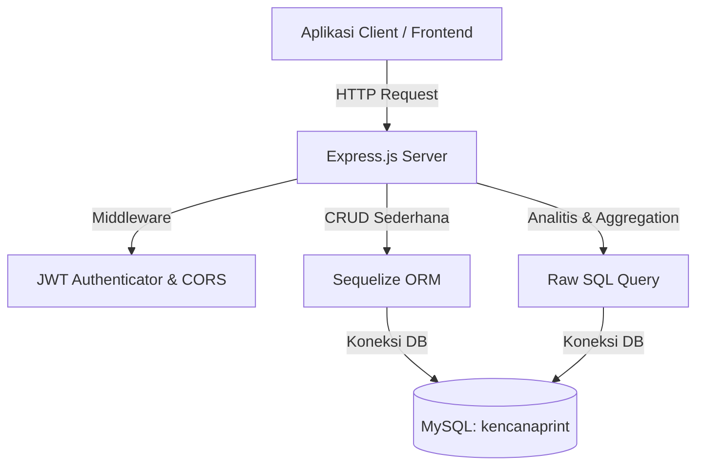
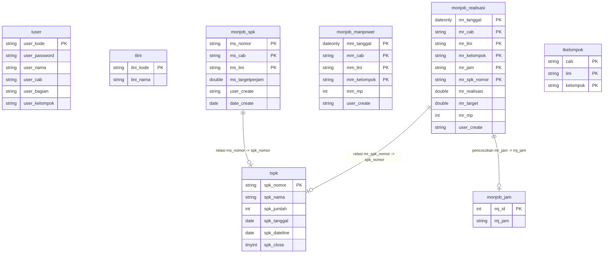

# Dokumentasi Sistem Backend (BE) Monitoring Job

Dokumentasi ini menyajikan panduan arsitektur, skema database, pemetaan API, serta konfigurasi lingkungan untuk sistem Backend Monitoring Job aplikasi **Kencana Print**.

---

## 1. Pendahuluan & Tujuan Sistem
Sistem Backend Monitoring Job ini dikembangkan untuk mencatat, mengolah, dan menyajikan data produktivitas pekerja (realisasi target SPK) secara langsung per jam operasional di berbagai cabang, lini produksi, dan kelompok kerja.

Sistem ini membantu manajemen untuk:
*   Memantau pencapaian target produksi secara *real-time* per jam.
*   Mengontrol alokasi tenaga kerja (*Man Power*) harian di setiap lini.
*   Menghasilkan laporan performa (persentase realisasi terhadap target SPK).

---

## 2. Arsitektur Sistem (Pendekatan Hybrid)
Aplikasi ini dibangun menggunakan **Node.js** dan **Express** dengan pendekatan akses data **hybrid**:
1.  **Sequelize ORM:** Digunakan untuk mempermudah operasi CRUD (*Create, Read, Update, Delete*) sederhana pada data master seperti User, Lini, dan Manpower.
2.  **Raw SQL Query:** Digunakan untuk memproses kueri analitis yang rumit (pada modul Laporan dan Monitoring per jam) demi performa kecepatan kueri yang maksimal di database MySQL.



---

## 3. Skema Database & Tabel Utama
Sistem ini terhubung ke database **`kencanaprint`** di server VPS. Berikut adalah 8 tabel utama yang saling berelasi:



### Penjelasan Field & Relasi:
*   **`tuser`**: Menyimpan kredensial admin/operator cabang.
*   **`tspk`**: Master data Surat Perintah Kerja (SPK) dari sistem ERP utama.
*   **`monjob_spk`**: Menyimpan pengaturan target kuantitas per jam untuk tiap SPK.
*   **`monjob_manpower`**: Menyimpan total alokasi tenaga kerja per tanggal operasional.
*   **`monjob_realisasi`**: Pencatatan output kerja riil pekerja per jam operasional.

---

## 4. Standarisasi Format Response API
Semua endpoint API mengembalikan format JSON yang seragam untuk mempermudah integrasi di sisi Frontend.

### 4.1 Format Respon Sukses (HTTP 200 OK)
```json
{
  "ok": true,
  "message": "Pesan keberhasilan operasi",
  "data": { ... } // Berisi objek, array, atau null
}
```

### 4.2 Format Respon Gagal (HTTP 4xx / 5xx)
```json
{
  "ok": false,
  "message": "Detail pesan kesalahan"
}
```

---

## 5. Dokumentasi API (Endpoints)

### 5.1 Autentikasi & Pengguna (Tanpa Proteksi JWT)
*   **POST** `/api/admin/login`
    *   *Deskripsi:* Autentikasi operator cabang.
    *   *Payload:* `{ "user_kode": "...", "password": "..." }`
    *   *Response Data:* `{ "token": "...", "user": { "user_kode", "user_nama", "user_cab", ... } }`

*   **PUT** `/api/admin/change-password` *(Memerlukan JWT)*
    *   *Deskripsi:* Mengubah password operator yang sedang login.
    *   *Payload:* `{ "user_kode": "...", "old_password": "...", "new_password": "..." }`

### 5.2 Pengaturan Target SPK
*   **GET** `/api/spk-lini`
    *   *Deskripsi:* Mengambil daftar lini produksi aktif.
*   **GET** `/api/spk-target?lini=...`
    *   *Deskripsi:* Mengambil daftar target SPK berdasarkan lini.
*   **POST** `/api/spk-target`
    *   *Deskripsi:* Menyimpan pengaturan target per jam untuk suatu SPK.
*   **PUT** `/api/spk-target/:nomor`
    *   *Deskripsi:* Memperbarui target per jam SPK.
*   **DELETE** `/api/spk-target/:nomor`
    *   *Deskripsi:* Menghapus pengaturan target SPK.
*   **GET** `/api/spk-cari?nomor=...`
    *   *Deskripsi:* Mencari detail SPK dari master ERP berdasarkan nomor SPK.

### 5.3 Input Man Power (Tenaga Kerja)
*   **GET** `/api/manpower?lini=...&tanggal=...`
    *   *Deskripsi:* Mengambil daftar jumlah manpower per kelompok kerja.
*   **POST** `/api/manpower`
    *   *Deskripsi:* Menyimpan jumlah manpower baru.
*   **PUT** `/api/manpower`
    *   *Deskripsi:* Memperbarui jumlah manpower.
*   **DELETE** `/api/manpower`
    *   *Deskripsi:* Menghapus data setting manpower.

### 5.4 Input Realisasi Produksi
*   **GET** `/api/realisasi/jam-options`
    *   *Deskripsi:* Mengambil opsi daftar jam operasional monitoring.
*   **GET** `/api/realisasi?cab=...&tanggal=...`
    *   *Deskripsi:* Memuat daftar transaksi input realisasi.
*   **POST** `/api/realisasi`
    *   *Deskripsi:* Menyimpan/meng-update (upsert) data input realisasi produksi pekerja.
*   **DELETE** `/api/realisasi`
    *   *Deskripsi:* Menghapus data input realisasi.

### 5.5 Monitoring Live
*   **GET** `/api/monitoring?cab=...&tanggal=...&lini=...&kelompok=...`
    *   *Deskripsi:* Mengambil rangkuman persentase pencapaian serta data monitoring per jam.
    *   *Response Data:* `{ "persen": 85.5, "list": [ { "jam", "mp", "spk", "target", "realisasi", "persen" } ] }`
*   **GET** `/api/monitoring/detail`
    *   *Deskripsi:* Mengambil detail pemenuhan kuantitas total SPK yang sedang diproduksi.

### 5.6 Laporan Analitis
*   **GET** `/api/laporan?cab=...&date_from=...&date_to=...`
    *   *Deskripsi:* Mengambil data akumulasi performa laporan berkinerja tinggi.
    *   *Response Data:* `{ "summary": {...}, "by_date": [...], "by_per_line": [...], "by_spk": [...] }`

---

## 6. Konfigurasi Lingkungan & Pengamanan CORS

### 6.1 Variabel Lingkungan (`.env`)
```env
PORT=3002
DB_HOST=103.94.238.252
DB_PORT=3306
DB_NAME=kencanaprint
DB_USER=root
DB_PASS="Kencana#123"
DB_DIALECT=mysql
JWT_SECRET=monitoring
JWT_EXPIRES_IN=8h
CORS_ORIGINS=http://localhost:5172,http://127.0.0.1:5172
```

### 6.2 Cara Kerja Pengamanan CORS
*   **Mode Development:** Jika aplikasi dijalankan di PC lokal (tanpa mengeset `NODE_ENV` atau `NODE_ENV=development`), CORS akan **memperbolehkan semua origin** secara bebas untuk mempermudah proses debugging.
*   **Mode Production:** Jika aplikasi dijalankan dengan perintah `NODE_ENV=production`, server akan menyaring secara ketat dan hanya memperbolehkan domain yang terdaftar secara resmi di variabel `CORS_ORIGINS`.

---

## 7. Cara Menjalankan Aplikasi

### 7.1 Menjalankan di Lingkungan Lokal (Debugging)
1.  Unduh dependensi:
    ```bash
    npm install
    ```
2.  Jalankan server development (menggunakan nodemon):
    ```bash
    npm run dev
    ```

### 7.2 Menjalankan di Server Produksi
Gunakan *process manager* seperti PM2 dengan mendefinisikan variabel `NODE_ENV=production`:
```bash
NODE_ENV=production pm2 start src/server.js --name "be-monitoring"
```
